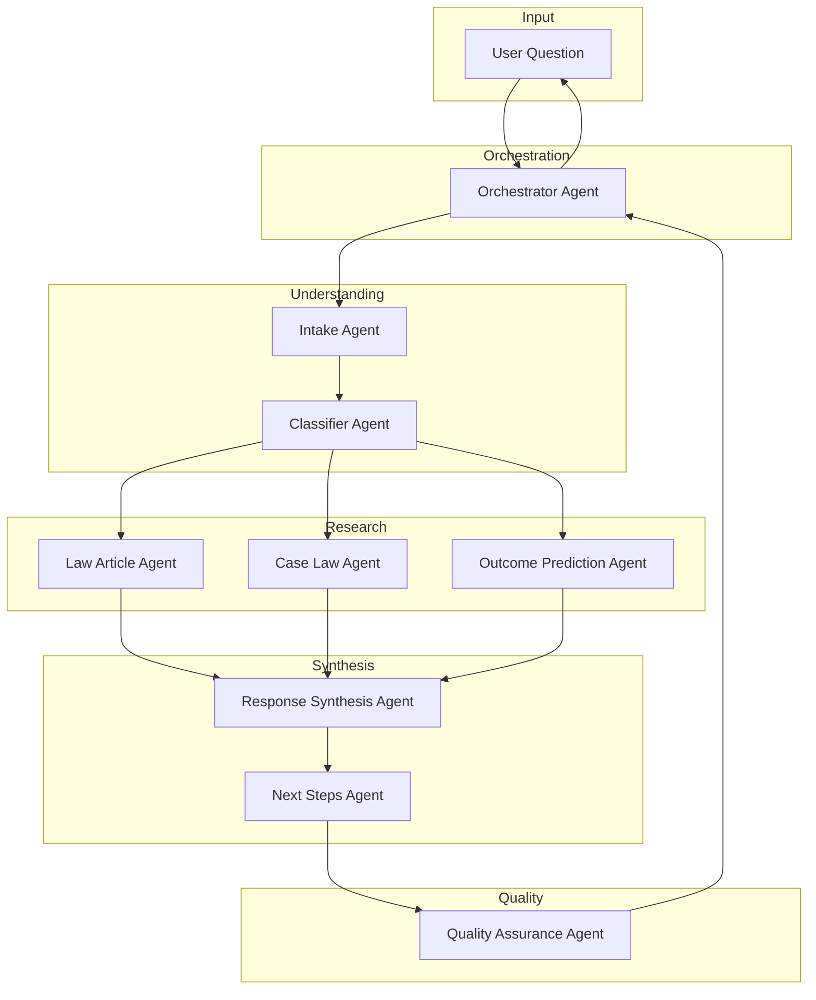
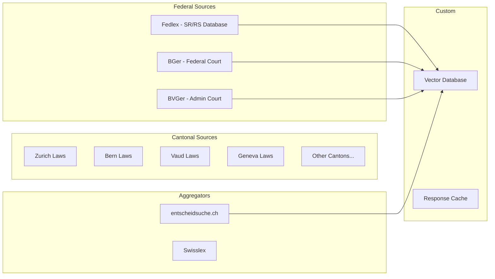
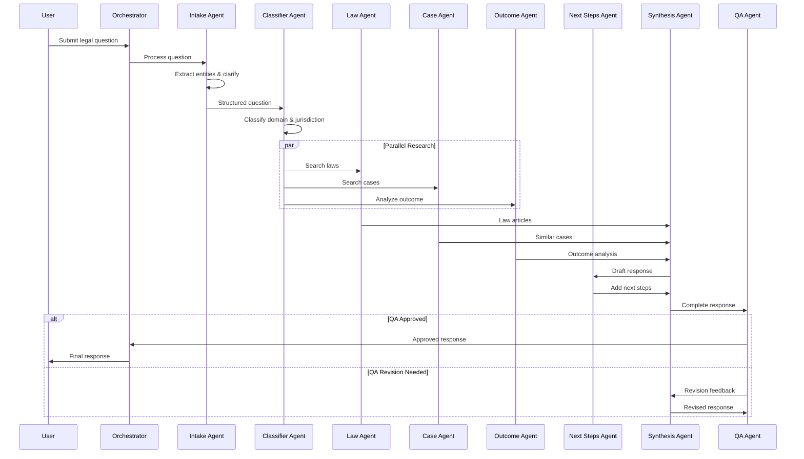

# Swiss Legal Support Agentic Workflow Architecture

## Overview

This document outlines the architecture for an agentic workflow designed to answer legal questions from the general public in Switzerland. The system provides comprehensive legal guidance using the Microsoft Agent Framework.

**Target Users**: General Public in Switzerland  
**Data Sources**: All available Swiss legal data sources  
**Scope**: All areas of Swiss law

## Target Output

For each user question, the system will provide:
1. **Relevant Law Articles** - Swiss federal and cantonal laws applicable to the situation
2. **Expected Outcome** - What the user can reasonably expect based on law and precedent
3. **Historical Similar Cases** - Court decisions with similar fact patterns
4. **Next Steps** - Practical guidance on how to proceed

---

## Agents Architecture

### Agent Overview Diagram



---

## Detailed Agent Specifications

### 1. Orchestrator Agent

**Role**: Central coordinator that manages the entire workflow

**Responsibilities**:
- Receive and validate user questions
- Coordinate the workflow sequence between agents
- Manage workflow state and conversation context
- Handle error recovery and retry logic
- Aggregate and deliver final response

**Instructions**:
```
You are the central coordinator for the Swiss Legal Support system.
Your role is to:
1. Receive user legal questions
2. Coordinate specialized agents to gather comprehensive information
3. Ensure all four output components are addressed:
   - Relevant law articles
   - Expected outcome
   - Historical similar cases
   - Next steps
4. Deliver a clear, helpful response to the user

Always maintain a helpful, professional tone suitable for the general public.
Never provide specific legal advice - always recommend consulting a lawyer for specific cases.
```

**Tools**: None (coordination only)

---

### 2. Intake Agent

**Role**: Clarifies and structures the user's legal question

**Responsibilities**:
- Parse and understand the user's question
- Identify key facts and circumstances
- Ask clarifying questions if needed
- Extract relevant entities (dates, amounts, parties, locations)
- Structure the question for downstream processing

**Instructions**:
```
You are the intake specialist for Swiss legal questions.
Your role is to:
1. Understand the user's legal situation
2. Extract key facts: who, what, when, where, how much
3. Identify the canton/location if relevant
4. Determine if this is an urgent matter
5. Ask clarifying questions only if critical information is missing

Output a structured summary with:
- Main legal issue
- Key facts
- Relevant jurisdiction (federal/cantonal)
- Timeline
- Parties involved

Be empathetic - users may be stressed about their legal situation.
```

**Tools**:
- `extract_entities` - NLP tool to extract dates, amounts, names, locations
- `detect_language` - Identify user's language (DE/FR/IT/EN)

---

### 3. Classifier Agent

**Role**: Identifies the legal domain and applicable jurisdiction

**Responsibilities**:
- Classify the legal domain (civil, criminal, administrative, labor, etc.)
- Determine applicable jurisdiction (federal vs cantonal)
- Identify relevant sub-domains
- Tag the case for appropriate routing

**Instructions**:
```
You are a Swiss legal domain classifier.
Analyze the structured question and classify it into:

Primary Legal Domains:
- Civil Law (Obligations, Property, Family, Inheritance)
- Criminal Law
- Administrative Law
- Labor Law
- Social Insurance Law
- Tax Law
- Immigration Law
- Tenancy Law
- Consumer Protection

Jurisdiction:
- Federal (Bundesrecht/Droit fédéral)
- Cantonal (specify which canton)
- Municipal

Output:
- Primary domain
- Secondary domains (if applicable)
- Jurisdiction level
- Relevant law collections (SR numbers)
```

**Tools**:
- `legal_domain_classifier` - ML model for legal domain classification

---

### 4. Law Article Agent

**Role**: Searches and retrieves relevant Swiss law articles

**Responsibilities**:
- Search federal law database (SR/RS - Systematische Rechtssammlung)
- Search cantonal law databases
- Identify the most relevant articles
- Provide context and explanations for each article

**Instructions**:
```
You are a Swiss law research specialist.
Based on the classified legal question, find relevant law articles.

Search in:
1. Federal laws (SR/RS numbers)
2. Cantonal laws (if applicable)
3. International treaties (if applicable)

For each relevant article, provide:
- Full citation (SR number, article number)
- Official text in user's language
- Plain language explanation
- How it applies to the user's situation

Focus on:
- Primary governing articles
- Related procedural rules
- Relevant exceptions or special cases
```

**Tools**:
- `search_laws` - Search law databases

---

### 5. Case Law Agent

**Role**: Finds historical court cases with similar fact patterns

**Responsibilities**:
- Search Swiss Federal Court (BGE/ATF) decisions
- Search cantonal court decisions
- Find cases with similar facts
- Extract relevant legal principles (Rechtsprechung)

**Instructions**:
```
You are a Swiss case law research specialist.
Find court decisions relevant to the user's situation.

Search in:
1. Swiss Federal Supreme Court (BGE/ATF)
2. Federal Administrative Court (BVGer)
3. Federal Patent Court
4. Cantonal courts (if relevant)

For each relevant case, provide:
- Case citation (e.g., BGE 140 III 115)
- Date and court
- Brief fact summary
- Legal principle established
- How it relates to the user's situation
- Outcome and reasoning

Prioritize:
- Recent decisions (last 10 years)
- Leading cases (Leitentscheide)
- Similar fact patterns
```

**Tools**:
- `search_bge` - Search Federal Court decisions
- `search_bvger` - Search Federal Administrative Court
- `semantic_case_search` - Vector similarity search for cases
- `get_case_details` - Retrieve full case information

---

### 6. Outcome Prediction Agent

**Role**: Analyzes likely outcomes based on law and precedent

**Responsibilities**:
- Analyze the legal situation
- Consider applicable laws and case law
- Assess strengths and weaknesses
- Provide realistic outcome expectations

**Instructions**:
```
You are a legal outcome analyst for Swiss law.
Based on the facts, applicable laws, and case precedents, analyze likely outcomes.

Provide:
1. Most likely outcome(s)
2. Factors favoring the user
3. Factors against the user
4. Probability assessment (high/medium/low likelihood)
5. Key uncertainties

Important disclaimers:
- This is general guidance, not legal advice
- Actual outcomes depend on specific circumstances
- Courts have discretion in many matters
- New facts could change the analysis

Be balanced and realistic - do not give false hope or unnecessary alarm.
```

**Tools**:
- `analyze_legal_strength` - Assess case strength
- `compare_to_precedents` - Compare with similar cases

---

### 7. Next Steps Agent

**Role**: Determines actionable guidance for the user

**Responsibilities**:
- Identify immediate actions needed
- Provide procedural guidance
- List relevant deadlines and time limits
- Recommend professional resources

**Instructions**:
```
You are a legal procedure advisor for Switzerland.
Provide clear, actionable next steps for the user.

Include:
1. Immediate actions
   - Urgent deadlines (prescription periods, appeal deadlines)
   - Documents to gather
   - Evidence to preserve

2. Procedural options
   - Informal resolution (negotiation, mediation)
   - Formal procedures (court, administrative)
   - Alternative dispute resolution

3. Professional resources
   - When to consult a lawyer
   - Legal aid options (Rechtsschutzversicherung, unentgeltliche Rechtspflege)
   - Relevant associations or ombudsman services

4. Cost considerations
   - Estimated costs
   - Fee structures
   - Insurance coverage

Be practical and specific to Swiss procedures.
```

**Tools**:
- `find_legal_resources` - Find lawyers, legal aid, ombudsman
- `estimate_costs` - Estimate procedural costs

---

### 8. Response Synthesis Agent

**Role**: Compiles all research into a coherent, user-friendly response

**Responsibilities**:
- Aggregate outputs from all research agents
- Structure information clearly
- Adapt language for general public
- Ensure completeness of all four output components

**Instructions**:
```
You are a legal communication specialist.
Compile the research findings into a clear, helpful response.

Structure the response as:

1. SUMMARY
   Brief overview of the legal situation

2. RELEVANT LAWS
   - Key articles with plain language explanations
   - How they apply to this situation

3. SIMILAR CASES
   - Relevant precedents
   - What courts have decided in similar situations

4. EXPECTED OUTCOME
   - Likely outcomes
   - Key factors
   - Uncertainties

5. NEXT STEPS
   - Immediate actions
   - Available options
   - Professional resources

Use clear, non-technical language.
Include proper citations for verification.
Add appropriate disclaimers about seeking professional advice.
```

**Tools**:
- `format_citations` - Format legal citations properly
- `simplify_legal_language` - Convert legalese to plain language

---

### 9. Quality Assurance Agent

**Role**: Validates and ensures completeness of the response

**Responsibilities**:
- Check all four output components are present
- Verify legal citations are correct
- Ensure appropriate disclaimers are included
- Check for consistency and accuracy
- Flag any issues for review

**Instructions**:
```
You are a quality assurance specialist for legal information.
Review the synthesized response for:

1. Completeness
   - All four components present (laws, cases, outcome, next steps)
   - Question fully addressed
   - No missing critical information

2. Accuracy
   - Legal citations are correct
   - Case references are accurate
   - Deadlines are properly calculated

3. Appropriateness
   - Language suitable for general public
   - Proper disclaimers included
   - No unauthorized legal advice given

4. Safety
   - Urgent matters flagged appropriately
   - Professional consultation recommended when needed
   - No harmful guidance

Return APPROVED or NEEDS_REVISION with specific feedback.
```

**Tools**:
- `verify_citations` - Check legal citations exist and are correct
- `check_completeness` - Verify all components present

---

## Tools Inventory

### Data Retrieval Tools

| Tool Name | Description | Data Source |
|-----------|-------------|-------------|
| `search_federal_laws` | Search Swiss federal law database | admin.ch / fedlex.admin.ch |
| `search_cantonal_laws` | Search cantonal law databases | Cantonal legal portals |
| `get_law_article` | Retrieve specific law article text | Fedlex API |
| `search_bge` | Search Federal Court decisions | bger.ch / entscheidsuche.ch |
| `search_bvger` | Search Federal Administrative Court | bvger.ch |
| `semantic_case_search` | Vector similarity search for cases | Vector DB (custom) |
| `get_case_details` | Retrieve full case information | Court APIs |

### Analysis Tools

| Tool Name | Description | Implementation |
|-----------|-------------|----------------|
| `legal_domain_classifier` | ML model for legal domain classification | Custom ML model |
| `extract_entities` | NLP entity extraction | spaCy / custom NER |
| `analyze_legal_strength` | Assess case strength | LLM-based analysis |
| `compare_to_precedents` | Compare with similar cases | Semantic similarity |

### Utility Tools

| Tool Name | Description | Implementation |
|-----------|-------------|----------------|
| `detect_language` | Identify user language (DE/FR/IT/EN) | langdetect / custom |
| `estimate_costs` | Estimate procedural costs | Fee schedules |
| `format_citations` | Format legal citations | Custom formatter |
| `simplify_legal_language` | Convert to plain language | LLM-based |
| `verify_citations` | Verify legal citations | Database lookup |
| `find_legal_resources` | Find lawyers, legal aid | Directory APIs |

---

## Data Sources

### Swiss Legal Data Sources



### Data Source Details

| Source | Content | Access Method | Update Frequency |
|--------|---------|---------------|------------------|
| Fedlex (admin.ch) | Federal laws (SR/RS) | API / Scraping | Daily |
| BGer (bger.ch) | Federal Court decisions | API | Weekly |
| BVGer | Admin Court decisions | API | Weekly |
| entscheidsuche.ch | Aggregated court decisions | API | Daily |
| Cantonal portals | Cantonal laws & decisions | Scraping | Weekly |

---

## Workflow Sequence

### Main Workflow



### Declarative Workflow Definition

The workflow will be implemented using the Microsoft Agent Framework's declarative YAML format:

```yaml
kind: Workflow
name: SwissLegalSupport
description: Answer legal questions for the Swiss general public

trigger:
  kind: OnConversationStart
  id: legal_support_workflow
  
  actions:
    # Step 1: Intake - Understand the question
    - kind: InvokeAzureAgent
      id: intake_step
      agent:
        name: IntakeAgent
      input:
        messages: =System.LastMessage.Text
      output:
        responseObject: Local.StructuredQuestion

    # Step 2: Classify the legal domain
    - kind: InvokeAzureAgent
      id: classify_step
      agent:
        name: ClassifierAgent
      input:
        arguments:
          question: =Local.StructuredQuestion
      output:
        responseObject: Local.Classification

    # Step 3: Parallel research phase
    - kind: Parallel
      id: research_phase
      branches:
        - kind: InvokeAzureAgent
          id: law_research
          agent:
            name: LawArticleAgent
          input:
            arguments:
              question: =Local.StructuredQuestion
              classification: =Local.Classification
          output:
            responseObject: Local.LawArticles

        - kind: InvokeAzureAgent
          id: case_research
          agent:
            name: CaseLawAgent
          input:
            arguments:
              question: =Local.StructuredQuestion
              classification: =Local.Classification
          output:
            responseObject: Local.SimilarCases

        - kind: InvokeAzureAgent
          id: outcome_analysis
          agent:
            name: OutcomePredictionAgent
          input:
            arguments:
              question: =Local.StructuredQuestion
              classification: =Local.Classification
          output:
            responseObject: Local.OutcomeAnalysis

    # Step 4: Synthesize response
    - kind: InvokeAzureAgent
      id: synthesis_step
      agent:
        name: SynthesisAgent
      input:
        arguments:
          question: =Local.StructuredQuestion
          laws: =Local.LawArticles
          cases: =Local.SimilarCases
          outcome: =Local.OutcomeAnalysis
      output:
        responseObject: Local.DraftResponse

    # Step 5: Add next steps
    - kind: InvokeAzureAgent
      id: next_steps
      agent:
        name: NextStepsAgent
      input:
        arguments:
          question: =Local.StructuredQuestion
          classification: =Local.Classification
          draft: =Local.DraftResponse
      output:
        responseObject: Local.CompleteResponse

    # Step 6: Quality assurance
    - kind: InvokeAzureAgent
      id: qa_check
      agent:
        name: QualityAgent
      input:
        arguments:
          response: =Local.CompleteResponse
      output:
        responseObject: Local.QAResult

    # Step 7: Handle QA result
    - kind: ConditionGroup
      id: qa_decision
      conditions:
        - condition: =Local.QAResult.approved
          actions:
            - kind: SendActivity
              id: send_response
              activity: =Local.CompleteResponse.text
        - condition: =Not(Local.QAResult.approved)
          actions:
            - kind: InvokeAzureAgent
              id: revision_step
              agent:
                name: SynthesisAgent
              input:
                arguments:
                  draft: =Local.CompleteResponse
                  feedback: =Local.QAResult.feedback
              output:
                autoSend: true
```

---

## Implementation Considerations

### Multi-Language Support

Switzerland has four national languages. The system must:
- Detect user's preferred language (DE/FR/IT/EN)
- Retrieve laws in the appropriate language
- Respond in the user's language
- Handle legal terminology correctly in each language

### Privacy & Data Protection

- No personal data stored beyond session
- Comply with Swiss data protection law (nDSG)
- Clear privacy policy displayed
- Option for anonymous usage

### Disclaimers

Every response must include:
- This is general legal information, not legal advice
- Consult a qualified lawyer for specific situations
- Laws and interpretations may have changed
- Outcomes depend on specific circumstances

### Error Handling

- Graceful degradation if data sources unavailable
- Clear messaging when information is incomplete
- Escalation path to human support
- Logging for continuous improvement

---

## Summary: Agents and Tools

### Agents (8 total)

| # | Agent | Primary Responsibility | Key Output |
|---|-------|----------------------|--------